# AWS Instance Scheduler

Instance Scheduler는 [EC2 Scheduler](https://aws.amazon.com/ko/answers/infrastructure-management/ec2-scheduler/)의 문제점을 보안한 솔루션으로 사용자가 EC2와 RDS 인스턴스에 대한 사용자 정의 스케쥴을 구성할 수 있게 해줍니다.
이 솔루션은 AWS 서버 운영비용을 절감하는데 많은 도움을 줍니다. 월~금요일 하루 10시간만 운용한다고 했을 경우 70%의 서버 운영비용을 절감할 수 있습니다.

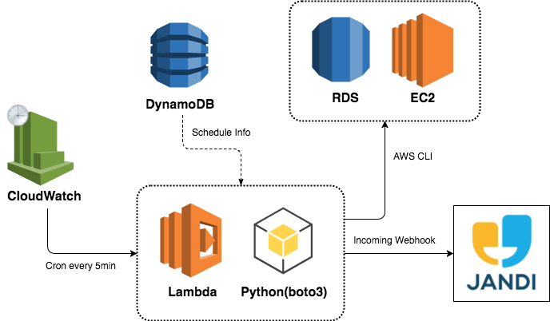

## Features
- 스케쥴링 시간에 따른 Instance Start/Stop
- 스케쥴 Timezone 설정
- 서버 그룹 의존관계 설정
- 스케쥴 예외설정
- 서버 강제 실행 / 중지
- Jandi 메신저로 상태 알람
- 스케쥴 봇

## TimeZone 설정

기본설정은 Asia/Seoul로 설정되어 있으며 다른 Timezone을 원하면 main.py 파일의 15라인의 타임존 설정값을 변경하세요.

```
os.environ['TZ'] = 'Asia/Seoul'
time.tzset()
```

## Dynamo DB 설정

Dynamo DB에 스케쥴 정보를 정의하는 3개의 Table을 생성합니다.

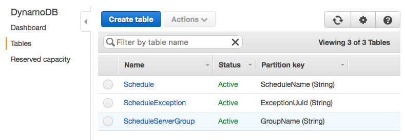

### 1. Schedule
Schedule Table에는 스케쥴의 기본 정보를 설정한다.

```json
{
  "ScheduleName": "SampleSchedule",
  "TagValue": "SampleScheduleTag",
  "DaysActive": "weekdays",
  "Enabled": true,
  "StartTime": "09:00",
  "StopTime": "18:00",
  "ForceStart": false
}
```
1. ScheduleName : 스케쥴명
2. TagValue : Instance Tag 값
3. DaysActive : 적용 요일
    * all : 매일
    * weekdays : 월~금
    * mon,wed,fri : 월,수,금 (특정 요일 , 구분으로 지정)
4. Enabled : 스케쥴 활성여부
5. StartTime : 시작시간 (None, H:M)
6. StopTime : 중지시간 (None, H:M)
7. ForceStart : 강제시작여부

StarTime과 StopTime은 24시간제로 표시하며 None으로 설정시 작동시키지 않습니다.
ForceStart가 true로 설정시 스케쥴 시간이나 Enabled 여부와 상관없이 다음 Lambda가 Trigger 되는 시점에 서버를 시작시키며 서버가 모두 시작되면 자동으로 false로 변경됩니다.

### 2. ScheduleServerGroup
ScheduleServerGroup에는 서버그룹과 의존관계를 설정합니다.

```json
{
  "Dependency": [],
  "GroupName": "GROUP1",
  "InstanceType": "RDS",
  "ScheduleName": "SampleSchedule"
},
{
  "Dependency": [],
  "GroupName": "GROUP2",
  "InstanceType": "EC2",
  "ScheduleName": "SampleSchedule"
},
{
  "Dependency": [
    "GROUP1"
    "GROUP2"
  ],
  "GroupName": "GROUP3",
  "InstanceType": "EC2",
  "ScheduleName": "SampleSchedule"
}
```
1. Dependency : 서버 그룹 의존관계
2. GroupName : 서버 그룹명
3. InstanceType : 인스턴스 타입 (EC2, RDS)
4. ScheduleName : 스케쥴명

위와 같이 설정할 경우 GROUP1, GROUP2 -> GROUP3 순서로 시작하게 됩니다.
GROUP1과 GROUP2는 의존관계가 없기 때문에 처음에 시작하게 되고 GROUP3는 GROUP1과 GROUP2과 시작된 후에 시작하게 됩니다.

### 3. ScheduleException
ScheduleException에는 특정일의 스케쥴 변경사항을 설정합니다.
```json
{
  "ExceptionUuid": "414faf09-5f6a-4182-b8fd-65522d7612b2",
  "ScheduleName": "SampleSchedule",
  "ExceptionDate": "2017-07-10",
  "ExceptionType": "stop",
  "ExceptionValue": "21:00"
}
```
1. ExceptionUuid : 스케쥴 예외 고유번호
2. ScheduleName : 스케쥴명
3. ExceptionDate : 예외발생일
4. ExceptionType : 예외타입 (start, stop)
5. ExceptionValue : 시간 (None, H:M)

## Instance Tagging
설정된 스케쥴에 포함시킬 인스턴스를 설정하기 위해서는 각 Instance Tag에 아래와 같이 Tagging을 합니다.

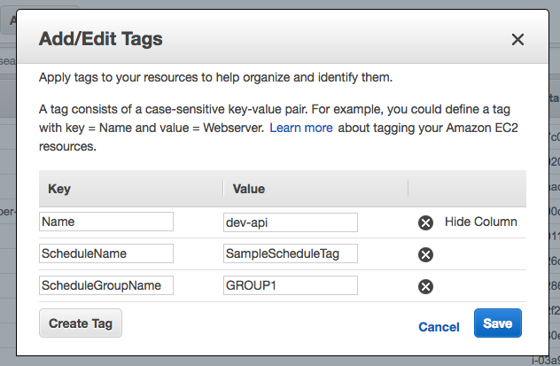

ScheduleName에는 Schedule Table에 설정된 TagValue 값을 Tagging합니다.
서버 그룹이 존재한다면 ScheduleGroupName 을 추가로 Tagging 합니다.
서버 그룹이 없으면 ScheduleName 으로 Tagging된 모든 Instance를 동시에 시작 시킵니다.

## Lambda Deploy
Apex을 이용하여 배포를 합니다. 자세한 설정은 [Apex Github](https://github.com/apex/apex) 을 참조하세요.

```
$ apex delpoy
```

## Cloudwatch Event 설정

Cloudwatch Event를 통해 배포된 Instance Scheduler Lambda 함수를 주기적으로 실행하게 됩니다.

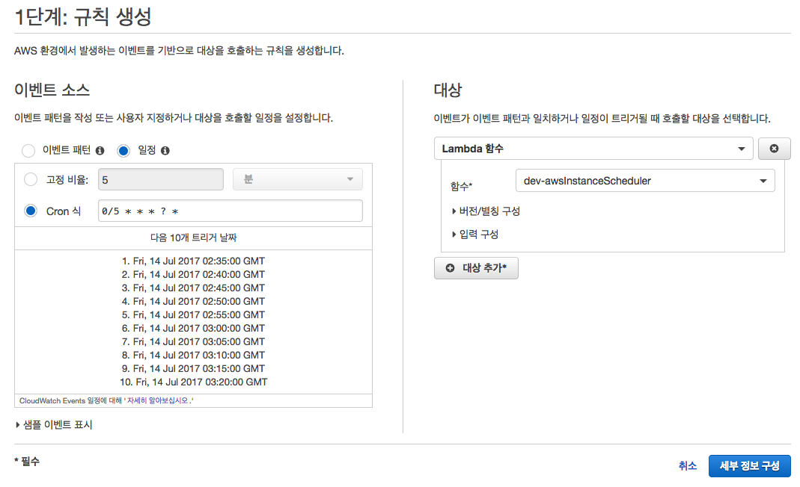

5분마다 작동되게 설정하였으며 상황에 따라 설정값을 바꾸셔되 됩니다.

## Schedule Alarm

스케쥴의 알람은 Jandi 메신저의 Incoming Webhook을 이용하여 특정 토픽으로 메시지를 전송합니다.

### Incoming Webhook Connect 설정
Jandi 메신저에서 알람을 받을 토픽에서 커넥트 연동하기에서 Incoming Webhook을 추가하고 Webhook Url을 복사합니다.

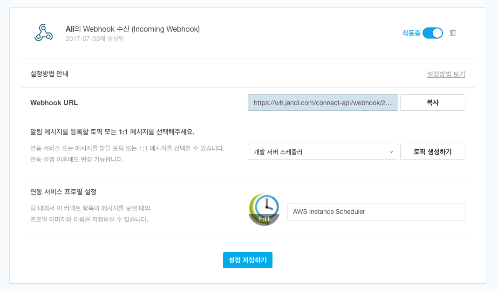

### Lambda Environment 설정
```
{
    "type": "python3.6",
    "description": "Aws Instance Scheduler",
    "hooks":{
        "build": "pip install -r requirements.txt -t python_modules"
    },
    "environment": {
        "WEBHOOK_URL": "<<INCOMING_WEBHOOK_URL을 여기에 붙여넣기 하세요>>",
        ...
    }
}

```
/functions/awsInstanceScheduler/function.json 파일의 environment의 WEBHOOK_URL 값을 설정 후 Lambda를 배포하거나 AWS Console 에서 Lambda 함수의 Code 탭에서 Environment variables 을 직접 설정할 수 있다.

1. 서버가 시작될때 알람

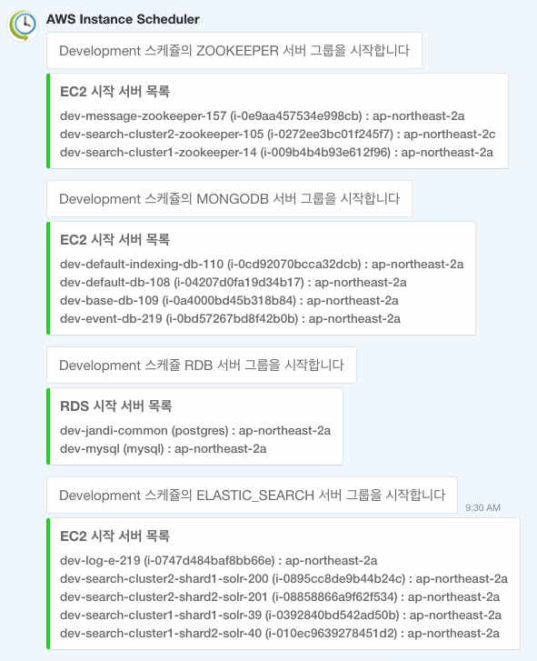

2. 서버 중지 10분전 알람

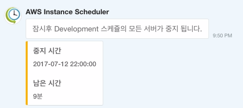


## Schedule Bot

Schedule Bot은 스케쥴의 예외설정, 강제 서버 실행/중지, 서버 상태 조회 등의 기능을 수행합니다.
Scheduler Bot은 Jandi의 Outgoing Webhook Connect를 이용하여 Api Gateway의 Endpoint를 호출하게되고 Api Gateway와 연결된 Lambda 함수를 작동시켜 명령을 주고 받습니다.
Instance Scheduler Lambda는 Scheduler와 Bot이 하나의 함수로 되어 있으며 Lambda가 Trigger 될때 Api Gateway를 통해서 실행되면 Bot이 작동하며 Cloudwatch event를 통해서 작동하게 되면 Scheduler가 작동하게 된다.

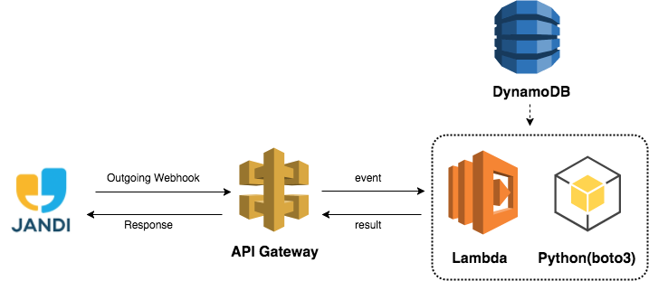

### Api Gateway 와 Lambda 연결

Jandi 메신저를 통해 Lambda를 실행시키기 위해서는 Lambda함수와 API Gateway를 연결하여 Http Endpoint를 생성해야 합니다.

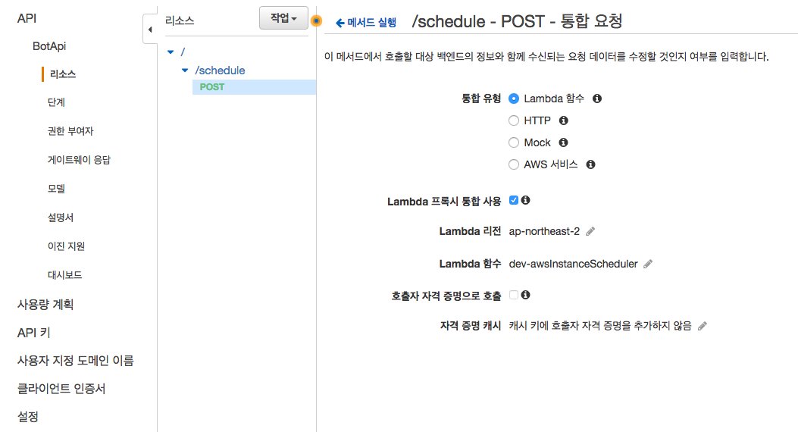

Endpoint에 POST Method와 Lambda함수를 연결한뒤 단계를 생성한뒤 해당 Method의 Endpoint URL을 복사합니다.

### Outgoing Webhook Connect 설정

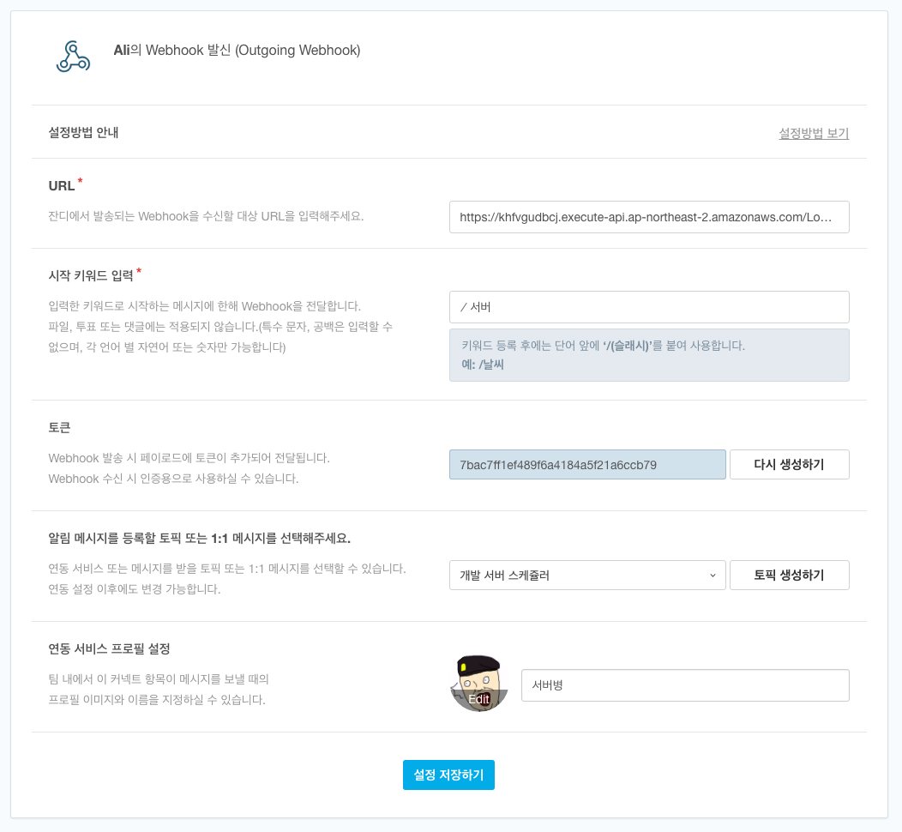

Jandi 메신저의 Outgoing Webhook Connect를 생성 후 위 Api Gateway에서 발급받은 Endpoint URL을 Outgoing Webhook URL에 붙여넣기 합니다.
그리고 토큰값을 복사하여 Lambda Environment의 OUTGOING_WEBHOOK_TOKEN에 설정합니다.

```
{
    "type": "python3.6",
    "description": "Aws Instance Scheduler",
    "hooks":{
        "build": "pip install -r requirements.txt -t python_modules"
    },
    "environment": {
        ...
        "OUTGOING_WEBHOOK_TOKEN": "<<OUTGOING_WEBHOOK_TOKEN을 여기에 붙여넣기 하세요>>"
    }
}

```

### Bot Command

Schedule Bot은 다음과 같은 명령어를 수행한다.

```
/서버 help : 도움말
/서버 [스케쥴명] status : 현재 서버 상태 조회
/서버 [스케쥴명] info : 오늘의 스케쥴 조회
/서버 [스케쥴명] info [YYYY-MM-DD] : 특정일 스케쥴 조회
/서버 [스케쥴명] exception info : 오늘의 스케쥴 예외 조회
/서버 [스케쥴명] exception info [YYYY-MM-DD] : 특정일 스케쥴 예외 조회
/서버 [스케쥴명] exception set [YYYY-MM-DD] [start|stop] [h:m] : 예외 설정
/서버 [스케쥴명] exception del [YYYY-MM-DD] [start|stop] : 예외 삭제
/서버 [스케쥴명] force_start : 서버 강제실행
/서버 [스케쥴명] force_stop : 서버 강제중지
```

1. 스케쥴 정보 조회

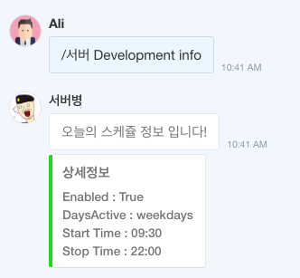

2. 서버 상태 조회

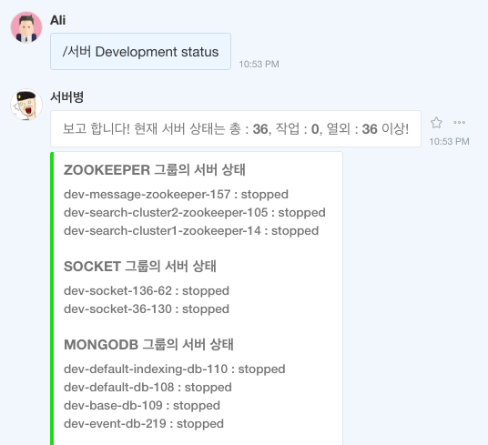

3. 서버 강제 시작 / 중지

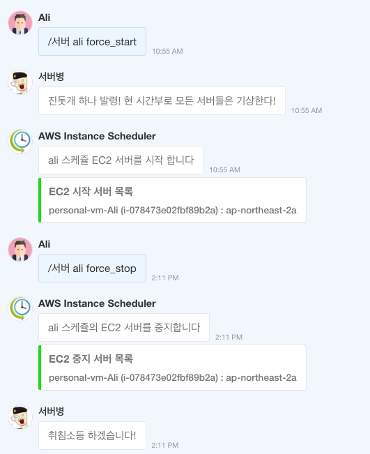

4. 명령어 오류

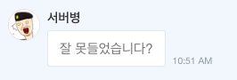